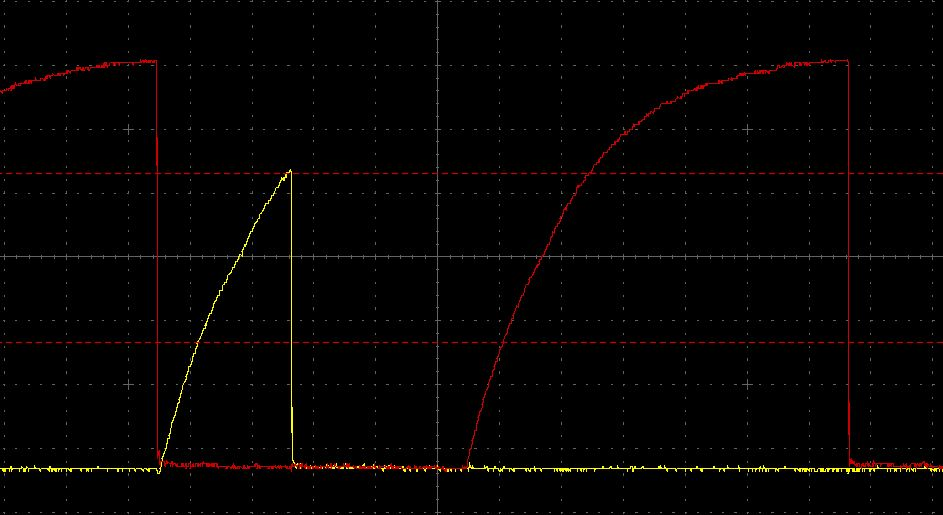

# Odd Looking I2C Oscilloscope Traces

## Introduction
Real oscilloscope traces capture behaviour that looks odd, but is actually
perfectly normal. This document describes some of these behaviours.

The traces in this document show the I2C clock (SCL) in red and the data line
(SDA) in yellow.

## SDA Spikes
### Behaviour
This trace shows the end of a 0 bit followed by a second 0 bit.

SDA starts to rise after the first clock pulse and is pulled LOW again almost
immediately. The rise time is quite long on this system, so SDA didn't make it
all the way to Vdd before it was pulled LOW.

It's quite common to see this after an ACK.

This behavior is perfectly harmless because the I2C Specification allows SDA
to change value more than once before settling down.

### Background Information
In I2C, the transmitting device sets SDA to the correct value for a bit when
the clock (SCL) is LOW. The receiving device reads the value of SDA when SCL
goes HIGH.

Devices can pull a line LOW, but they can't push it HIGH. The pullup resistors
do that. This means that lines often fall very fast but rise quite slowly.

### Explanation
In I2C, a byte consists of 8 data bits followed by an ACK. The transmitter
controls SDA while it's sending the data bits. The receiver replies with a 
0 bit to say "received Ok". That's the ACK. The transmitter then starts the
next byte.

This means that control of SDA starts with the transmitter, is handed to the
receiver for the ACK and then returns to the transmitter again.

In this example, the transmitter is the master. It releases SDA at the end of
the last data bit so SDA starts to rise. The receiver waits for a moment and
pulls SDA LOW to send an ACK. The spike is the brief period when SDA is rising.

This spike happens whenever:
* control of SDA passes from one device to the other
* both devices need to write 0
* the first device releases SDA before the second device decides to pull it LOW

If both devices are pulling SDA LOW at the same time then there's no spike.

The height of the spike is determined by the SDA rise time and the amount of
time that passes before SDA is pulled low again. In some cases you'll see it
reach Vdd. In other cases, it's a barely noticeable blip.
