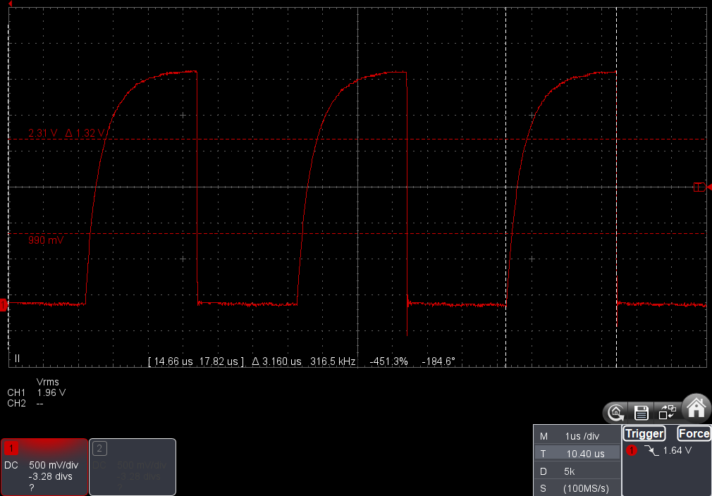
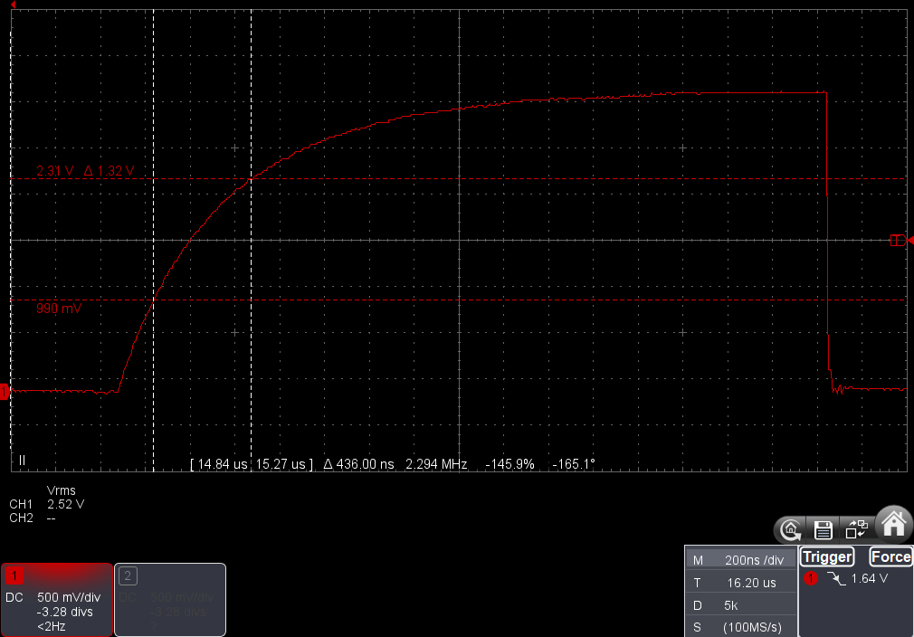

# Pullup Resistors and Rise Times

## Introduction
I2C is not a "plug and play" system. If you connect enough devices
to an I2C bus, or you use really long wires, then it'll stop working.
Even worse, it might work intermittently but not reliably!

The main reason for this is that the bus depends on pullup resistors.
The article explains what pullups do and gives recommendations for
tuning them.

See the [I2C Bus](https://www.i2c-bus.org/i2c-primer/typical-i2c-bus-setup/)
website for a detailed and friendly description of I2C wiring
and principles.

## Rise Times and Pullup Resistors
### Rise and Fall Times
I2C bus lines rely on open-drain/open-collector electronics.
This means that a device can pull a line LOW whenever it likes, but it
can't push a line HIGH on its own. Instead, it relies on a pullup
resistor to pull the voltage up to Vdd. Vdd is
the device's supply voltage. It's usually 3.3 V these days but older
hardware often runs at 5 V.

I2C devices pull the line LOW by shorting the line to GND. This is really
fast; 5 to 10 nanoseconds is fairly typical. This time is known as the
"fall time".

The "rise time" is the time taken for the line to climb from LOW to HIGH.
It's usually much, much longer than the fall time; anything up to 1000
nanoseconds.

This oscilloscope trace shows 3 pulses on SCL. Note the way that the voltage
rises slowly but drops vertically. The white measurement lines on the last
pulse really highlight the difference.

### Pull Up Resistors
The rise time depends on the bus capacitance and the strength of the
pullup resistors.

High resistance pullups are said to be "weak" because they give
large rise times. "Strong" pullups have low resistance. They lift
the voltage faster by pouring more current into the bus.

The following items *increase* the rise time:
* adding devices to the bus
* increasing the resistance of the pullups (AKA weakening them)
* lengthening bus wires
* rerouting bus wires in a way that increases capacitance

These factors mean that it's not possible to specify the size of the
pullups for a particular circuit without seeing it. You really need to
[measure](#measuring-rise-and-fall-times) the rise times and then
adjust the pullups to suit.

Note that most microcontrollers and breakout boards have builtin pullups.
These are usually fairly weak. e.g. 22 kΩ. They may be enough for a bus
with 2 devices running at low speed. They're rarely strong enough for
more complex buses. This explains why some projects appear to work without
pullups. The pullups are hidden away in devices. 

### I2C Specification Limits
The [I2C Specification](https://www.nxp.com/docs/en/user-guide/UM10204.pdf)
sets limits on the these times. The key one is the maximum rise time.
If your rise times are within the limits then the bus should work.
If they're too long then all bets are off. The bus might work just fine.
It might not work at all. If you're unlucky it'll work erratically in
a way that's truly baffling.

This table gives the limits for the most common I2C modes.
All durations are in nanoseconds. 

#### Rise Times
| Mode     | Speed     | Min (ns) | Max (ns) |
|----------|-----------|----------|----------|
| Standard | < 100 kHz | NA       | 1000     |
| Fast     | < 400 kHz | 20       | 300      |
| Fast+    | < 1 MHz   | NA       | 120      |

#### Fall Times
| Mode     | Speed     | Min (ns) | Max (ns) |
|----------|-----------|----------|----------|
| Standard | < 100 kHz | NA       | 300      |
| Fast     | < 400 kHz | 12       | 300      |
| Fast+    | < 1 MHz   | 12       | 120      |

Note that many I2C devices have minimum fall times that are shorter
than the minimum allowed by the spec. Very fast fall times may create
electrical noise but are otherwise harmless.

## Measuring Rise and Fall Times
There's no real substitute for actually measuring the rise times.
Even fairly simple bus circuits can be surprising.

You need to attach a measuring device to the bus to measure them. This
inevitably increases the bus capacitance which increases the rise times.
The change can be enough to exceed the maximum rise time limit. If the
rise times are below the maximum when you measure them, then they'll
definitely be low enough when you disconnect the measuring device.

### LineTester
The [LineTester](../../src/line_test/line_tester.h) class estimates
rise and fall times. It actively drives the bus lines to measure their
response. This could cause other I2C devices to crash or act weirdly.

LineTester works for most installations but will give incorrect
results if the voltage curve has a weird shape.

See the comments in the code for tips about using it. The key one is to
ensure that all your devices are connected and enabled before measuring the
bus. Disconnecting devices reduces the rise times so you need everything
connected to measure the right value.
                       
### Using an Oscilloscope
The definitive way to measure rise and fall times is to use an oscilloscope.
This has the advantage that you will see the actual voltage curve. You
can take the opportunity to check for weird responses, incorrect high and
low voltages etc.

The rise time is the time taken for the voltage to rise from
0.3 Vdd to 0.7 Vdd. 
The fall time is measured from 0.7 Vdd to 0.3 Vdd.

Here's a trace of a single SCL pulse. Vdd is 3.3 V. The red
horizontal lines are set to 0.7 Vdd and 0.3 Vdd.
(2.31 V and 0.99 V respectively.) The white vertical lines mark the
start and end of the rise time as defined by the I2C spec.

The oscilloscope reports the time between the 2 white lines as Δ.
That gives the rise time for this system as 436 nanoseconds. That's perfect
for standard mode running at 100 kHz. It might work at 400 kHz but
definitely won't support a 1 MHz bus. 

The fall time is less than 10 nanoseconds. It's actually too fast for me
to measure accurately with my oscilloscope!

## Tuning
My recommended tuning strategy is:
1. assemble your bus
2. measure the rise times
3. adjust the pullups to give the desired rise times

Repeat the process whenever you add devices to the bus.

### Rise Times
Avoid wildly different rise times on the 2 lines. e.g. 100 nanos on
SDA but 900 nanos on SCL. This reduces the effective time between
a slow edge and a fast one. This in turn can cause a device to break
one of the timing requirements given by the I2C spec. I'd aim for
the slower line to have less than double the rise time of the faster one. 

Avoid very long rise times. They're more likely to trigger obscure
bugs in specific devices. I'd aim to be less than 70% of the maximum
allowed in the spec. e.g. < 700 nanos for standard mode at 100 kHz.

Avoid very short rise times. It doesn't provide any advantage and it
increases the amount of current your system needs. I'd aim to keep
the rise time above 30% of the maximum allowed in the spec.

Here's a summary. Aim to be in the sweet spot unless you've got a good
reason otherwise.

| Mode     | Speed     | Min (ns) | Sweet Spot (ns) | Max (ns) |
|----------|-----------|----------|-----------------|----------|
| Standard | < 100 kHz | NA       | 300 - 7000      | 1000     |
| Fast     | < 400 kHz | 20       | 90 - 210        | 300      |
| Fast+    | < 1 MHz   | NA       | 35 - 85         | 120      |

### Pullup Current
Avoid pullups that pull large currents. I'd aim for 3 mA or less.
Lowering the current will reduce power consumption and battery drain.

You can calculate the current easily. I = Vdd/R. e.g. a 2.2 kΩ resistor
will pull 1.5 mA on a 3.3 V bus.

You can damage devices if the current is too high! This puts a hard
limit on the number of devices you can attach to the bus. 

### Fall Times
Avoid wildly different fall times on the 2 lines. I'd aim to keep them
30 nanoseconds of each other. You might encounter logic problems if
one is very fast and the other is very long even if both are within
the specified limits. e.g. 20 nanoseconds on one line and 200 nanos
on the other.

The fall time of a lines is controlled by the pin's "drive strength".
A weaker drive strength will increase the fall time. This helps to reduce
electrical switching noise.

You may find that your device's drive strength setting has very little
impact on the fall time. This is certainly true for the Teensy 4. The data
sheet claims that the fall time varies between 2 and 8 nanoseconds. That
makes it impossible to make it comply with the I2C spec. This seems to be
typical for modern I2C devices though, so I don't think it's worth worrying
about.
